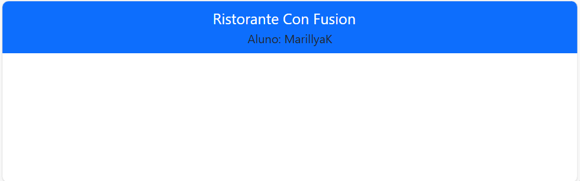

# Relatório: Exercício (Instruções) - Configuração do Aplicativo React

## Passo 1
No terminal, foram executados os seguintes comandos:

```bash
npm install reactstrap react react-dom
npm install --save bootstrap
npm install react-popper @popperjs/core
```

## Passo 2
No **Visual Studio Code**, abri a pasta `src` e no arquivo `index.js` foi adicionado o comando abaixo:

```js
import 'bootstrap/dist/css/bootstrap.min.css';
```

## Passo 3
Ainda na pasta `src`, abri o arquivo `App.js` e adicionei o seguinte código:

```js
<Navbar dark color="primary">
    <div className="container">
        <NavbarBrand href="/">Ristorante Con Fusion</NavbarBrand>
        <div>Aluno: MarillyaK</div>
    </div>
</Navbar>
```

### Explicando o Código

1. **`<Navbar dark color="primary">`**: A barra de navegação tem fundo escuro e uma cor azul como tema(ela defini uma cor primaria automaticamente).
2. **`<div className="container">`**: Coloca o conteúdo dentro de uma "caixa" para centralizar tudo.
3. **`<NavbarBrand href="/">Ristorante Con Fusion</NavbarBrand>`**: Exibe o nome do restaurante, que quando clica ele leva à página inicial.
4. **`<div>Aluno: MarillyaK</div>`**: Mostra o nome do aluno que está desenvolvendo o site.

Ou seja, **é uma barra de navegação simples com o nome do restaurante e a identificação do aluno.**

### Importações que foram feitas:

```js
import { Navbar, NavbarBrand } from 'reactstrap';
```

## Passo 4
O processo foi um sucesso. Abaixo, terá uma imagem que mostra o **navbar** em funcionamento:


