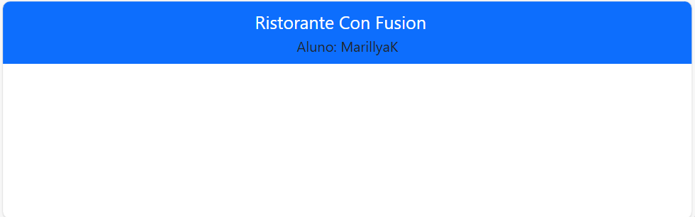

# Relatório: Exercício (Instruções) - Configuração do Aplicativo React

## Passo 1
No terminal, foram executados os seguintes comandos:

```bash
npm install reactstrap react react-dom
npm install --save bootstrap
npm install react-popper @popperjs/core
```

## Passo 2
No **Visual Studio Code**, abri a pasta `src` e no arquivo `index.js` foi adicionado o comando abaixo:

```js
import 'bootstrap/dist/css/bootstrap.min.css';
```

## Passo 3
Ainda na pasta `src`, abri o arquivo `App.js` e adicionei o seguinte código:

```js
<Navbar dark color="primary">
    <div className="container">
        <NavbarBrand href="/">Ristorante Con Fusion</NavbarBrand>
        <div>Aluno: MarillyaK</div>
    </div>
</Navbar>
```

### Explicando o Código

1. **`<Navbar>`**: Ele vai criar uma barra de navegação.
2. **`dark`**: Faz a barra ficar com a cor escura.
3. **`color="primary"`**: Esse comando vai define a cor principal da barra.
4. **`<NavbarBrand>`**: Coloca o nome "Ristorante Con Fusion" na barra. Esse nome ele serve como um link que vai levar para a página inicial.
5. **`<div>Aluno: MarillyaK</div>`**: Vai exibir o nome de um aluno na barra, abaixo do nome do restaurante.

Resumindo: **É uma barra com o nome de um restaurante e o nome de um aluno.** Ela tem uma cor escura e, ao clicar no nome do restaurante, leva à página inicial.

### Importações que foram feitas:

```js
import { Navbar, NavbarBrand } from 'reactstrap';
```

## Passo 4
O processo foi um sucesso. Abaixo, há um link para a imagem que mostra o **navbar** em funcionamento:


